<!-- PROJECT SHIELDS -->
<!--
*** I'm using markdown "reference style" links for readability.
*** Reference links are enclosed in brackets [ ] instead of parentheses ( ).
*** See the bottom of this document for the declaration of the reference variables
*** for contributors-url, forks-url, etc. This is an optional, concise syntax you may use.
*** https://www.markdownguide.org/basic-syntax/#reference-style-links
-->

[![LinkedIn][linkedin-shield]][linkedin-url]

<!-- PROJECT LOGO -->
 

    

<h3 align="center">AutoMagic Developer Portfolio Web Application</h3>

<!-- TABLE OF CONTENTS -->

  
Table of Contents

  <ol>
    <li><a href="#about-the-project">About The Project</a></li>
    <li><a href="#main-features">Main Features</a></li>
    <li><a href="#screenshots">Screenshots</a></li>
    <li><a href="#preview-video">Preview Video</a></li>
    <li><a href="#contact">Contact</a></li>
  </ol> 

<!-- ABOUT THE PROJECT -->

## About The Project

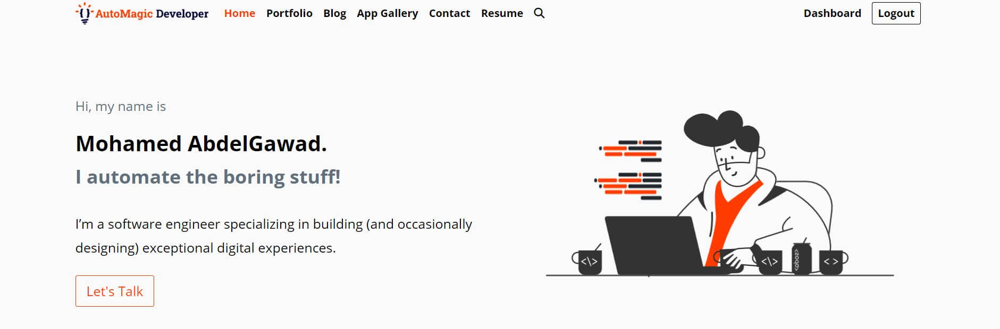

* Project Name: AutoMagic Developer Portfolio Web Application
* Version: v1.0.0
* Hosted on: [automagicdeveloper.com](https://automagicdeveloper.com)

### About The Project

This project is a fully functional web application built using Django, designed to showcase my professional work,
skills, and accomplishments. The goal of the portfolio is to provide an interactive and detailed presentation of my
projects, blog posts, and apps while maintaining a user-friendly interface and a powerful backend for analytics and
monitoring.

## Main Features

* **Portfolio:** Showcases my personal and professional projects, skills, and achievements, providing potential clients
  and collaborators a comprehensive view of my work.

* **Blog:** A dedicated space for sharing thoughts, experiences, and technical insights with visitors. The blog supports
  multiple posts, categorized content, and user interaction through comments.

* **App Gallery:** An organized gallery featuring the applications I’ve developed, complete with a smooth slider to
  enhance the user experience.

* **Insights Dashboard:** Provides detailed analytics about published projects, including visitor traffic (via Google
  Analytics), and helps me assess the impact of my work.

* **Contact Form:** A contact page integrated with Google reCAPTCHA to ensure security, allowing visitors to reach out
  directly.

* **Admin Dashboard:**
    * Monitors **website traffic** via Google Analytics.
    * Displays **server utilization** statistics, powered by a separate System Monitor running in its own container.
    * Tracks **cloud billing** data, specifically from DigitalOcean, helping me keep an eye on resource usage and
      expenses.

(<a href="#readme-top">back to top</a>)

### Built With

This project was developed using the following tech stacks:

* Python (Django Backend Framework)
* HTML
* CSS
* JavaScript

(<a href="#readme-top">back to top</a>)

<!-- Screenshots -->

## Screenshots

#### Admin Dashboard

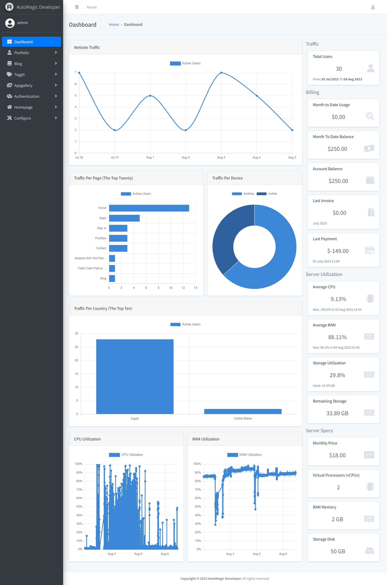

#### Insights Dashboard

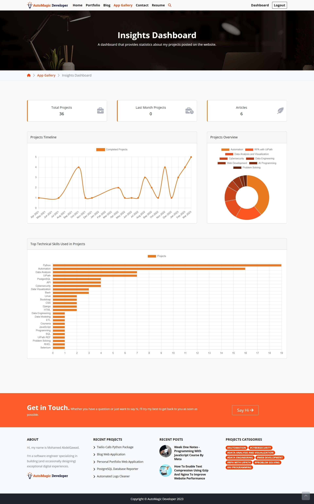

#### Homepage

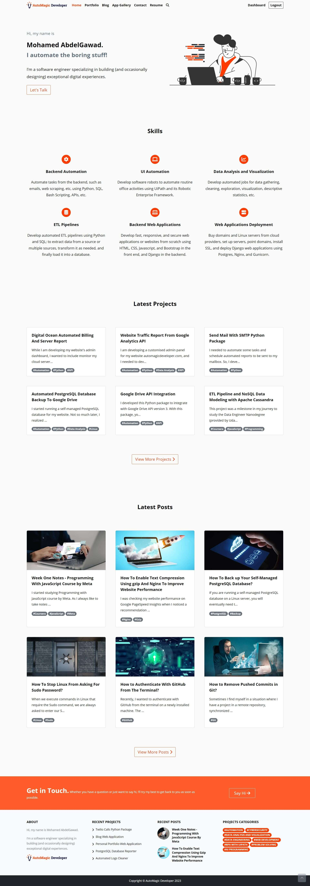

#### App Gallery

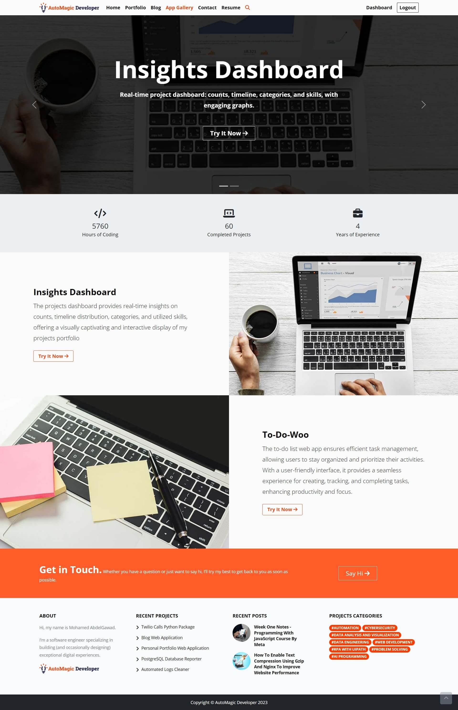

#### Portfolio List

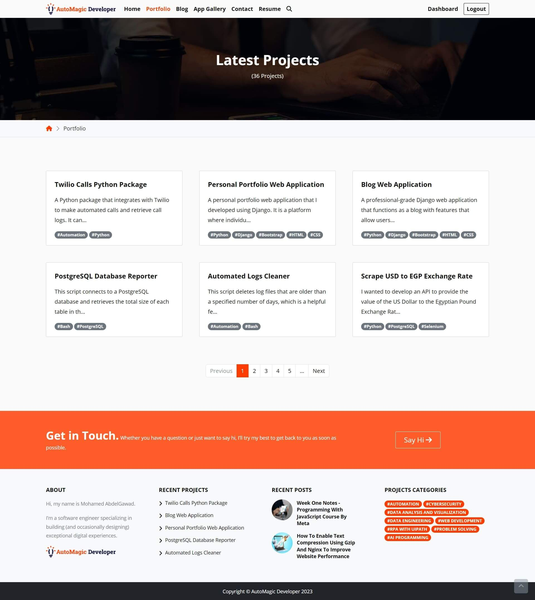

#### Portfolio Project

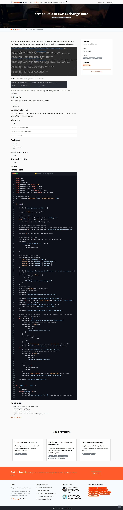

#### Blog List

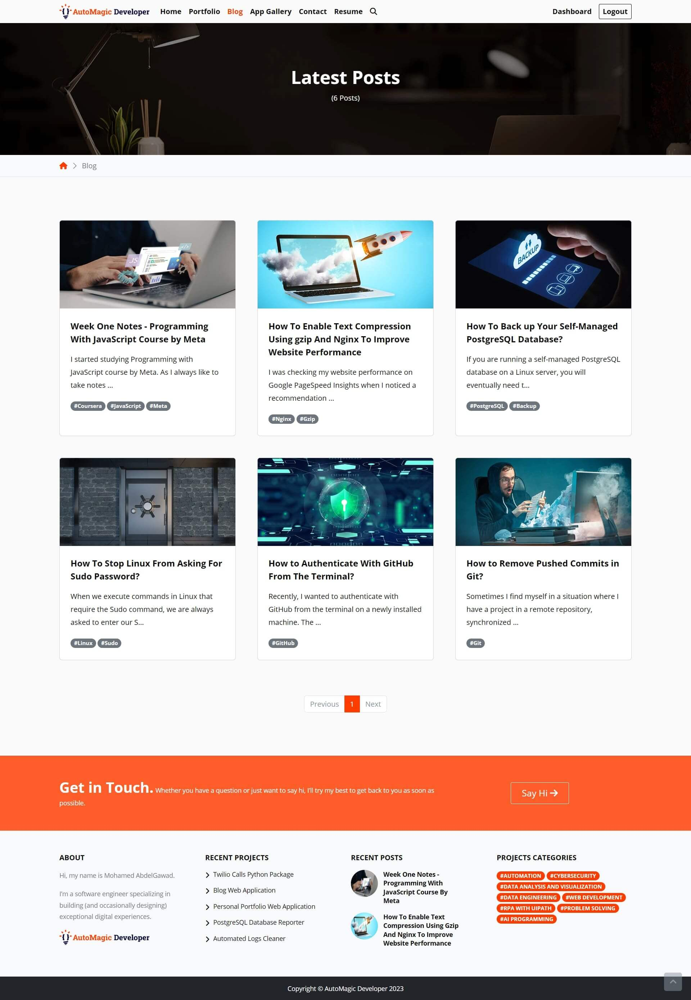

#### Blog Post

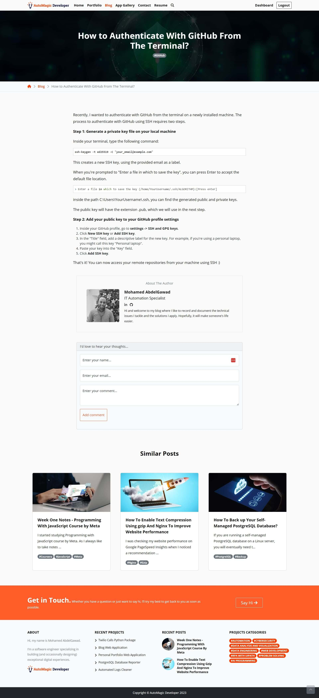

#### Contact Page

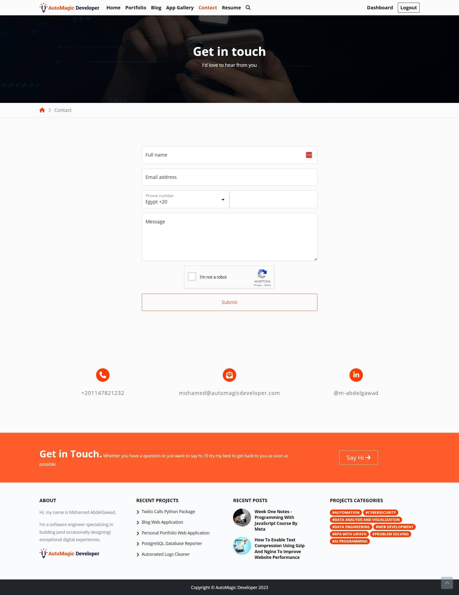

#### Login / Register

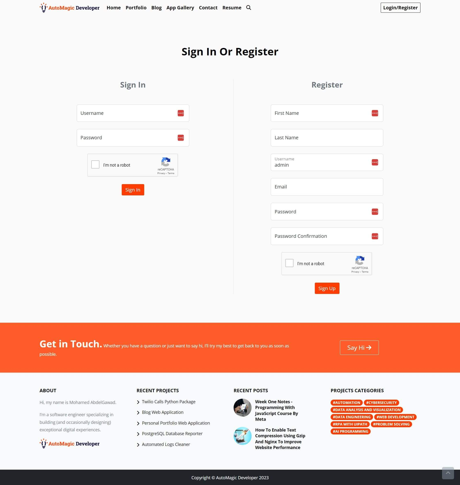

(<a href="#readme-top">back to top</a>)

<!-- Preview Video -->

## Preview Video

[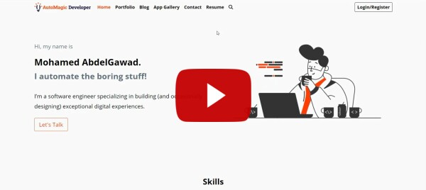](https://youtu.be/39FHj4iAQSA)

(<a href="#readme-top">back to top</a>)

<!-- CONTACT -->

## Contact

Mohamed AbdelGawad Ibrahim - [@m-abdelgawad](https://www.linkedin.com/in/m-abdelgawad/) - <a href="tel:+201069052620">
+201069052620</a> - muhammadabdelgawwad@gmail.com

GitHub Profile Link: [https://github.com/m-abdelgawad](https://github.com/m-abdelgawad)

(<a href="#readme-top">back to top</a>)

<!-- MARKDOWN LINKS & IMAGES -->
<!-- https://www.markdownguide.org/basic-syntax/#reference-style-links -->

[linkedin-shield]: https://img.shields.io/badge/-LinkedIn-black.svg?style=for-the-badge&logo=linkedin&colorB=555

[linkedin-url]: https://www.linkedin.com/in/m-abdelgawad/
